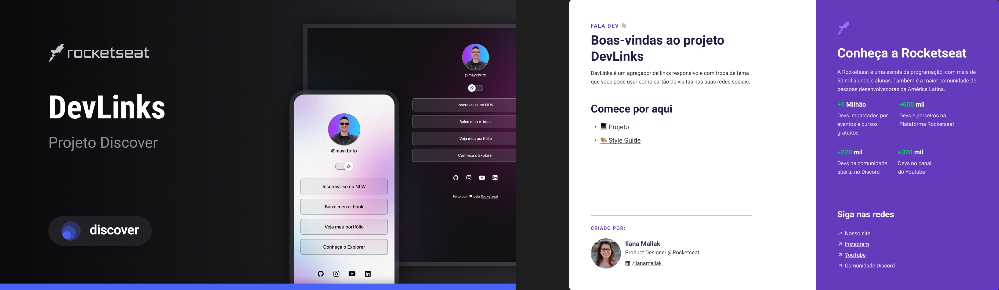

<h1 align="center"> DevLink </h1>

Projeto produzido pela Rocketseat.

  <a href="#-tecnologias">Tecnologias</a>&nbsp;&nbsp;&nbsp;|&nbsp;&nbsp;&nbsp;
  <a href="#-projeto">Projeto</a>&nbsp;&nbsp;&nbsp;|&nbsp;&nbsp;&nbsp;
  <a href="#-layout">Layout</a>&nbsp;&nbsp;&nbsp;|&nbsp;&nbsp;&nbsp;
  <a href="#memo-licença">Licença</a>

  

 

  

## 🚀 Tecnologias

Esse projeto foi desenvolvido com as seguintes tecnologias:

- HTML e CSS
- JavaScript
- Git e Github
- Figma

## 💻 Projeto

O DevLinks é um agregador de link para uso em cartão virtual.

## 🔖 Layout

Você pode visualizar o layout do projeto através deste link
(https://www.figma.com/design/VSaMu4Ce51fOoND1KkvV38/DevLinks-%E2%80%A2-Projeto-Discover-(Community)?node-id=10-620&p=f&t=ddJ0UjRXatvT3gQs-0)

 Feito com ♥ pela RocketSeat 
